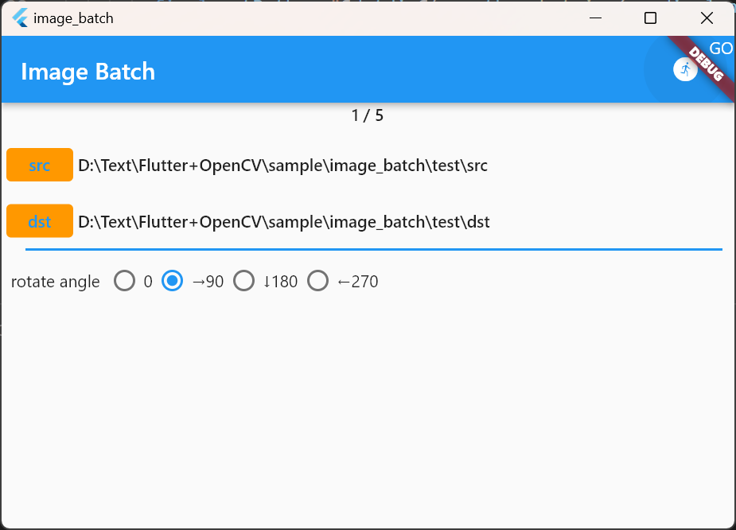
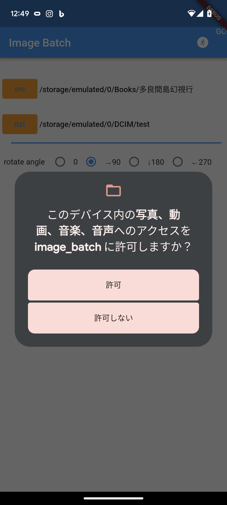

# image_batch

指定されたディレクトリ内の画像ファイルをそれぞれOpenCVで回転させて、指定されたディレクトリに格納します。

本書には書いてませんが、Androidの版数によっては権限の問題でディレクトリのファイル一覧が取得できません。

簡易的に権限を追加するには以下のようにしてください。ただしこれはAndroid13のPixel6で有効な処置ですが、
将来AndroidOSの版数が変わると、この方法では対処できなくなるかもしれません。
Androidのストレージまわりの権限の複雑さは、いいかげんにしてほしいなあ。

## Android権限の追加方法

1. android/app/src/main/AndroidManifest.xml のように権限のリクエストを追加
2. android/app/build.gradle のようにtargetSdkVersionの値を29以下に指定
3. 実行時にストレージ権限が要求されるので写真と動画に許可を指定

