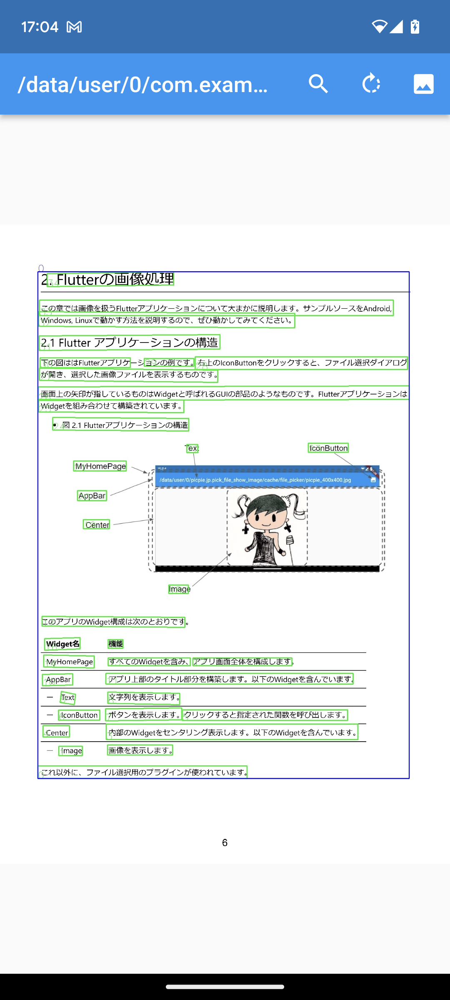

# text_detection

指定した画像からテキスト部分を検出し緑で囲んで描画。さらにそれら全部を含む領域をテキストの存在範囲として青で囲んで描画。
書類スキャン時にまわりの余分な部分をカットする目的などに使えそうです。
OpenCVのTextDetectionModelを使っています。

## Getting Started

以下はOpenCVのTextDetectionModelのドキュメントサイトです。

https://docs.opencv.org/4.x/d4/d43/tutorial_dnn_text_spotting.html?fbclid=IwAR29rH0HVqfHBczfmMbUTS__1-PRLfYYlQ-CsRvYrddfbQe5XB1gTDoQwvo

そこに検出モデル(TextDetectionModel‗DB)ファイルの入手先として

https://drive.google.com/drive/folders/1qzNCHfUJOS0NEUOIKn69eCtxdlNPpWbq

が書いてあるので、そこから適当なファイルをダウンロードしてassetsに格納します。
サイトには以下の４つのモデルが掲載されています。

|ファイル名            |  モデルの説明   |
|---------------------|-------|
|DB_TD500_resnet50.onnx|英語・中国語 高精度|
|DB_TD500_resnet18.onnx|英語・中国語 低精度|
|DB_IC15_resnet50.onnx |英語 高精度|
|DB_IC15_resnet18.onnx |英語 低精度|

それぞれ学習元のデータセットや学習精度が違うのですが、
サンプルプログラム text_detection はどれを使っても動作します。
モデルによる検出結果の違いなどは実際に試してみてください。

