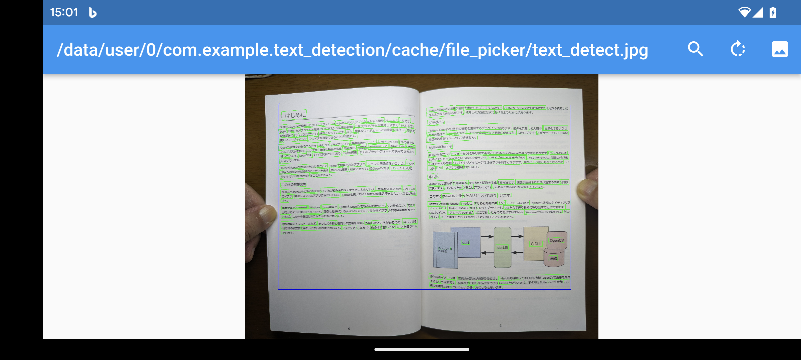

# text_detection

指定した画像からテキスト部分を検出し緑で囲んで描画。さらにそれら全部を含む領域をテキストの存在範囲として青で囲んで描画。
書類スキャン時のまわりの余分な部分をカットするなどに使えそう。

## Getting Started

https://docs.opencv.org/4.x/d4/d43/tutorial_dnn_text_spotting.html?fbclid=IwAR29rH0HVqfHBczfmMbUTS__1-PRLfYYlQ-CsRvYrddfbQe5XB1gTDoQwvo
から DB_TD500_resnet18.onnx をダウンロードしてassetsに格納する。

